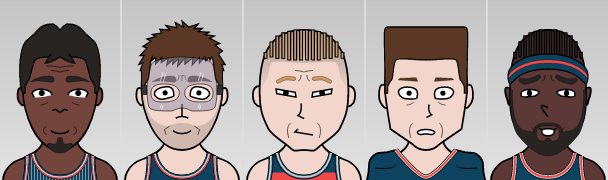

# faces.js

A JavaScript library for generating vector-based cartoon faces

[See a live demo here.](http://dumbmatter.com/facesjs/)

## Why?

I wrote this to generate random cartoon faces for players in [Basketball GM](https://basketball-gm.com/) and [Football GM](https://football-gm.com/). You can use it for similar purposes, or [other purposes](https://biowiki.org/wiki/index.php/Main_Page).

## Help wanted!

I am not an artist! The faces look kind of shitty! If you would like to help, please keep reading. With version 2 of faces.js, it will hopefully be easier for people to contribute. Even if you're new to programming or to JavaScript, I am happy to help you.

## Installation

    npm install --save facesjs

or

    yarn add facesjs

## Use

Import it with ES modules:

    import * as faces from "facesjs";

or CommonJS:

    const faces = require("facesjs");

Then, generate a random face:

    const face = faces.generate();

And display it:

    // Display in a div with id "my-div-id"
    faces.display("my-div-id", face);

    // Display in a div you already have a reference to
    const element = document.getElementById("my-div-id");
    faces.display(element, face);

If you'd like a non-random face, look inside the `face` variable and you'll see all the available options for a manually constructed face.

### Overrides

Both `display` and `generate` accept an optional final argument, specifying values to override either the randomly generated face (for `generate`) or the supplied face (for `display`). For instance:

    # Generate a random face that always has blue skin
    const face = faces.generate({ body: { color: "blue" } });

    # Display a face, but impose that it has blue skin
    faces.display("my-div-id", face, { body: { color: "blue" } });

### Options

The `generate` function takes a second optional arguement, which takes in extra parameters for player creation, in the form of an object. Currently, you can assign a race attribute that can be white, black, asian, or brown.

    # Generates a random player who will be white
    const face = faces.generate(null, {race: "white"});

## Development

Running `yarn run start` will do a few things:

1. Open a face viewer UI in your browser
2. Watch for changes to the code
3. Watch for changes to the facial feature SVG files
4. Update the face viewer UI when any code or SVG changes

This lets you immediately see your changes as you work.

## Adding new facial features

Each face is assembled from multiple SVGs. You can see them within the "svg" folder. If you want to add another feature, just create an SVG (using a vector graphics editor like [Inkscape](https://inkscape.org/)) and put it in the appropriate folder. It should automatically work. If not, it's a bug, please let me know!

When creating SVGs, assume the size of the canvas is 400x600. For most features, it doesn't mater where you draw on the canvas because it will automatically identify your object and position it in the appropriate place. But for head and hair SVGs, position does matter. For those you do need to make sure they are in the correct place on a 400x600 canvas, same as the existing head and hair SVGs. Otherwise it won't know where to place the other facial features relative to the head and hair.

If you find it not quite placing a facial feature exactly where you want, it's because by default it finds the center of the eye/eyebrow/mouth/nose SVG and places that in a specific location. If that's not good for a certain facial feature, that behavior can be overridden in code. For instance, see how it's done in display.js for the "pinocchio" nose which uses the left side of the SVG rather than the center to place it.

If you want a brand new "class" of facial features (like facial hair, or earrings, or hats) you'll have to create a new subfolder within the "svg" folder and edit the code to recognize your new feature.

If you find any of this confusing, feel free to reach out to me for help! I would love for someone to help me make better looking faces :)

## Technical details

### Minimizing import size

If you generate and display faces in separate bundles, you can decrease file size by only including the `display` or `generate` function in each bundle. You can import the `display` and `generate` functions individually and rely on tree shaking from your bundler. ES modules:

    import { display } from "facesjs";

or CommonJS:

    const { generate } = require("facesjs");

Or, import them directly if you don't trust your bundler :). ES modules:

    import generate from "facesjs/build/esmodules/generate";

or CommonJS:

    const display = require("facesjs/build/commonjs/display");

## Credits

[dumbmatter](https://github.com/dumbmatter) wrote most of the code and [TravisJB89](https://github.com/TravisJB89) made most of the graphics.
